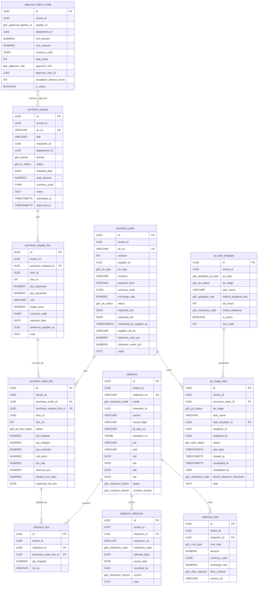

# GD1 Procurement And Import Tracking ERD

Source: `GD1_Technical_Requirements.docx`, version 1.0 draft dated 2026-05-27.

Companion SQL planning DDL: `docs/database/GD1_SCHEMA.sql`.

This file intentionally models only the tables named in the GD1 document:

- `purchase_request`
- `purchase_request_line`
- `purchase_order`
- `purchase_order_line`
- `shipment`
- `shipment_line`
- `shipment_milestone`
- `shipment_cost`
- `po_stage_task`
- `po_task_template`
- `approval_matrix_config` because section 6.1 names it as the configurable approval table.

External FK targets such as tenant, user, department, item, and supplier are referenced but not expanded because the GD1 document does not define their column schema.

## Naming And Common Columns

The GD1 document uses singular table names. Keep those names for this design document. If this is migrated into the current KBFE runtime later, map them deliberately instead of renaming runtime tables casually.

Every table follows the GD1 convention:

| Column | Type | Constraint |
|---|---|---|
| `id` | UUID | Primary key. |
| `tenant_id` | UUID | Required. FK to external tenant table. |
| `created_at` | TIMESTAMPTZ | Required, default `now()`. |
| `updated_at` | TIMESTAMPTZ | Required, default `now()`. |
| `created_by` | UUID | Nullable FK to external user table. |
| `updated_by` | UUID | Nullable FK to external user table. |
| `version` | INT | Required, default `1`, check `version >= 1`. |
| `deleted_at` | TIMESTAMPTZ | Nullable soft-delete timestamp. |

Money fields use:

| Meaning | Type |
|---|---|
| Amount, quantity, price | `NUMERIC(18,4)` |
| Exchange rate | `NUMERIC(18,6)` |
| Percent | `NUMERIC(5,2)` |
| Currency | `CHAR(3)` with uppercase ISO-4217 check |

## Type Setup

Use PostgreSQL enum types or equivalent check constraints.

```sql
CREATE TYPE gd1_priority AS ENUM ('NORMAL', 'HIGH', 'URGENT');

CREATE TYPE gd1_pr_status AS ENUM (
  'DRAFT',
  'SUBMITTED',
  'PARTIALLY_APPROVED',
  'APPROVED',
  'REJECTED',
  'CONVERTED',
  'CLOSED',
  'CANCELLED'
);

CREATE TYPE gd1_po_status AS ENUM (
  'DRAFT',
  'SENT',
  'CONFIRMED',
  'IN_PRODUCTION',
  'READY_TO_SHIP',
  'SHIPPED',
  'RECEIVED',
  'CLOSED',
  'CANCELLED'
);

CREATE TYPE gd1_po_line_status AS ENUM ('OPEN', 'PARTIALLY_SHIPPED', 'SHIPPED', 'RECEIVED', 'CLOSED', 'CANCELLED');
CREATE TYPE gd1_po_type AS ENUM ('SEA', 'AIR', 'DOMESTIC');
CREATE TYPE gd1_template_po_type AS ENUM ('SEA', 'AIR', 'DOMESTIC', 'ALL');
CREATE TYPE gd1_shipment_mode AS ENUM ('SEA', 'AIR');

CREATE TYPE gd1_shipment_status AS ENUM (
  'BOOKING_PENDING',
  'BOOKING_CONFIRMED',
  'CARGO_READY',
  'PICKED_UP',
  'BL_ISSUED',
  'GATE_IN_POL',
  'IN_TRANSIT',
  'CUSTOMS_DRAFT',
  'ARRIVED',
  'CUSTOMS_CLEARED',
  'DELIVERED',
  'CANCELLED'
);

CREATE TYPE gd1_customs_stream AS ENUM ('GREEN', 'YELLOW', 'RED');

CREATE TYPE gd1_milestone_code AS ENUM (
  'BOOKING_CONFIRMED',
  'CARGO_READY',
  'PICK_UP',
  'BL_ISSUED',
  'GATE_IN_POL',
  'ATD',
  'CUSTOM_DRAFT_SUBMITTED',
  'AN_ATA',
  'CUSTOM_CLEARED',
  'EDO_DELIVERY'
);

CREATE TYPE gd1_milestone_source AS ENUM ('MANUAL', 'API', 'EMAIL');
CREATE TYPE gd1_cost_type AS ENUM ('FREIGHT', 'INSURANCE', 'CUSTOMS_DUTY', 'VAT', 'LOCAL_CHARGES', 'DEMURRAGE', 'OTHER');
CREATE TYPE gd1_alloc_method AS ENUM ('BY_VALUE', 'BY_WEIGHT', 'BY_QTY');
CREATE TYPE gd1_task_status AS ENUM ('PENDING', 'IN_PROGRESS', 'DONE', 'BLOCKED', 'CANCELLED');
CREATE TYPE gd1_assignee_role AS ENUM ('BUYER', 'LOGISTICS', 'FINANCE', 'CUSTOMS_BROKER');
CREATE TYPE gd1_approver_role AS ENUM ('DEPARTMENT_MANAGER', 'DIVISION_DIRECTOR', 'CEO', 'CFO');
CREATE TYPE gd1_approval_applies_to AS ENUM ('PR', 'PO', 'BOTH');
```

## Mermaid ERD



## Table Definitions

### `purchase_request`

| Column | Type | Constraint |
|---|---|---|
| `id` | UUID | PK |
| `tenant_id` | UUID | NOT NULL, external FK |
| `pr_no` | VARCHAR(30) | NOT NULL, unique per tenant when active |
| `title` | VARCHAR(255) | NOT NULL |
| `requester_id` | UUID | NULL, external FK user |
| `department_id` | UUID | NULL, external FK department |
| `priority` | `gd1_priority` | NOT NULL, default `NORMAL` |
| `status` | `gd1_pr_status` | NOT NULL, default `DRAFT` |
| `required_date` | DATE | NOT NULL |
| `total_amount` | NUMERIC(18,4) | NOT NULL, default `0`, check `>= 0` |
| `currency_code` | CHAR(3) | NOT NULL, check uppercase ISO code |
| `notes` | TEXT | NULL |
| `submitted_at` | TIMESTAMPTZ | NULL |
| `approved_at` | TIMESTAMPTZ | NULL |
| common columns | See common column section |  |

Required constraints:

- Partial unique index: `(tenant_id, pr_no) WHERE deleted_at IS NULL`.
- `submitted_at IS NOT NULL` when status is `SUBMITTED`, `PARTIALLY_APPROVED`, `APPROVED`, `CONVERTED`, `CLOSED`, or `REJECTED`.
- `approved_at IS NOT NULL` when status is `APPROVED`, `CONVERTED`, or `CLOSED`.
- PR can move to `CONVERTED` only when every active line has `qty_converted = qty_requested`.

### `purchase_request_line`

| Column | Type | Constraint |
|---|---|---|
| `id` | UUID | PK |
| `tenant_id` | UUID | NOT NULL, external FK |
| `purchase_request_id` | UUID | NOT NULL, FK `purchase_request(id)` |
| `item_id` | UUID | NOT NULL, external FK item |
| `line_no` | INT | NOT NULL, check `> 0` |
| `qty_requested` | NUMERIC(18,4) | NOT NULL, check `> 0` |
| `qty_converted` | NUMERIC(18,4) | NOT NULL, default `0`, check `>= 0` |
| `unit` | VARCHAR(20) | NOT NULL |
| `target_price` | NUMERIC(18,4) | NULL, check `target_price IS NULL OR target_price >= 0` |
| `currency_code` | CHAR(3) | NOT NULL, check uppercase ISO code |
| `required_date` | DATE | NOT NULL |
| `preferred_supplier_id` | UUID | NULL, external FK supplier |
| `note` | TEXT | NULL |
| common columns | See common column section |  |

Required constraints:

- Unique `(purchase_request_id, line_no) WHERE deleted_at IS NULL`.
- Check `qty_converted <= qty_requested`.
- `purchase_request_id` cascades delete only for hard delete; soft delete should be inherited by application logic.

### `purchase_order`

| Column | Type | Constraint |
|---|---|---|
| `id` | UUID | PK |
| `tenant_id` | UUID | NOT NULL, external FK |
| `po_no` | VARCHAR(30) | NOT NULL, unique per tenant when active |
| `revision` | INT | NOT NULL, default `1`, check `>= 1` |
| `supplier_id` | UUID | NOT NULL, external FK supplier |
| `po_type` | `gd1_po_type` | NOT NULL |
| `incoterm` | VARCHAR(10) | NOT NULL |
| `payment_term` | VARCHAR(100) | NOT NULL |
| `currency_code` | CHAR(3) | NOT NULL, check uppercase ISO code |
| `exchange_rate` | NUMERIC(18,6) | NOT NULL, check `> 0` |
| `status` | `gd1_po_status` | NOT NULL, default `DRAFT` |
| `expected_etd` | DATE | NULL |
| `expected_eta` | DATE | NULL |
| `confirmed_by_supplier_at` | TIMESTAMPTZ | NULL |
| `supplier_ref_no` | VARCHAR(100) | NULL |
| `tolerance_over_pct` | NUMERIC(5,2) | NOT NULL, default `5.00`, check `0 <= value <= 20` |
| `tolerance_under_pct` | NUMERIC(5,2) | NOT NULL, default `3.00`, check `0 <= value <= 10` |
| `notes` | TEXT | NULL |
| common columns | See common column section |  |

Required constraints:

- Partial unique index: `(tenant_id, po_no) WHERE deleted_at IS NULL`.
- Check `expected_eta IS NULL OR expected_etd IS NULL OR expected_eta >= expected_etd`.
- `confirmed_by_supplier_at IS NOT NULL` when status is `CONFIRMED`, `IN_PRODUCTION`, `READY_TO_SHIP`, `SHIPPED`, `RECEIVED`, or `CLOSED`.
- PO revision must increment on any update after status `SENT`.

### `purchase_order_line`

| Column | Type | Constraint |
|---|---|---|
| `id` | UUID | PK |
| `tenant_id` | UUID | NOT NULL, external FK |
| `purchase_order_id` | UUID | NOT NULL, FK `purchase_order(id)` |
| `purchase_request_line_id` | UUID | NULL, FK `purchase_request_line(id)`; nullable for manual PO |
| `item_id` | UUID | NOT NULL, external FK item |
| `line_no` | INT | NOT NULL, check `> 0` |
| `status` | `gd1_po_line_status` | NOT NULL, default `OPEN` |
| `qty_ordered` | NUMERIC(18,4) | NOT NULL, check `> 0` |
| `qty_shipped` | NUMERIC(18,4) | NOT NULL, default `0`, check `>= 0` |
| `qty_received` | NUMERIC(18,4) | NOT NULL, default `0`, check `>= 0` |
| `unit_price` | NUMERIC(18,4) | NOT NULL, check `>= 0` |
| `tax_rate` | NUMERIC(5,2) | NOT NULL, default `0`, check `0 <= value <= 100` |
| `discount_pct` | NUMERIC(5,2) | NOT NULL, default `0`, check `0 <= value <= 100` |
| `landed_cost_alloc` | NUMERIC(18,4) | NOT NULL, default `0`, check `>= 0` |
| `expected_eta_line` | DATE | NULL |
| common columns | See common column section |  |

Required constraints:

- Unique `(purchase_order_id, line_no) WHERE deleted_at IS NULL`.
- If `purchase_request_line_id` is not null, total PO quantity sourced from the PR line must not exceed `purchase_request_line.qty_requested`.
- `qty_shipped` is derived from active `shipment_line` rows and should be recalculated transactionally.
- `qty_received` is reserved for GRN/WMS phase; GD1 may keep it at `0` until receiving integration.

### `shipment`

| Column | Type | Constraint |
|---|---|---|
| `id` | UUID | PK |
| `tenant_id` | UUID | NOT NULL, external FK |
| `shipment_no` | VARCHAR(30) | NOT NULL, unique per tenant when active |
| `mode` | `gd1_shipment_mode` | NOT NULL |
| `forwarder_id` | UUID | NULL, external FK supplier where supplier type is forwarder |
| `carrier` | VARCHAR(100) | NULL |
| `vessel_flight` | VARCHAR(100) | NULL |
| `bl_awb_no` | VARCHAR(100) | NULL |
| `container_no` | JSONB | NULL, array of container numbers; array of one for single container |
| `pol` | VARCHAR(100) | NULL |
| `pod` | VARCHAR(100) | NULL |
| `etd` | DATE | NULL |
| `eta` | DATE | NULL |
| `atd` | DATE | NULL |
| `ata` | DATE | NULL |
| `status` | `gd1_shipment_status` | NOT NULL, default `BOOKING_PENDING` |
| `customs_stream` | `gd1_customs_stream` | NULL |
| common columns | See common column section |  |

Required constraints:

- Partial unique index: `(tenant_id, shipment_no) WHERE deleted_at IS NULL`.
- Check `eta IS NULL OR etd IS NULL OR eta >= etd`.
- Check `ata IS NULL OR atd IS NULL OR ata >= atd`.
- Check `container_no IS NULL OR jsonb_typeof(container_no) = 'array'`.
- Status `DELIVERED` requires milestone `EDO_DELIVERY.actual_date` to be present.

### `shipment_line`

| Column | Type | Constraint |
|---|---|---|
| `id` | UUID | PK |
| `tenant_id` | UUID | NOT NULL, external FK |
| `shipment_id` | UUID | NOT NULL, FK `shipment(id)` |
| `purchase_order_line_id` | UUID | NOT NULL, FK `purchase_order_line(id)` |
| `qty_shipped` | NUMERIC(18,4) | NOT NULL, check `> 0` |
| `lot_no` | VARCHAR(100) | NULL |
| common columns | See common column section |  |

Required constraints:

- Index `(purchase_order_line_id)`.
- Unique `(shipment_id, purchase_order_line_id, lot_no) WHERE deleted_at IS NULL` if duplicate lot rows are not allowed.
- Total active `shipment_line.qty_shipped` per PO line must not exceed `purchase_order_line.qty_ordered * (1 + purchase_order.tolerance_over_pct / 100)`.

### `shipment_milestone`

| Column | Type | Constraint |
|---|---|---|
| `id` | UUID | PK |
| `tenant_id` | UUID | NOT NULL, external FK |
| `shipment_id` | UUID | NOT NULL, FK `shipment(id)` |
| `sequence_no` | SMALLINT | NOT NULL, check `1 <= sequence_no <= 10` |
| `milestone_code` | `gd1_milestone_code` | NOT NULL |
| `planned_date` | DATE | NULL |
| `actual_date` | DATE | NULL |
| `recorded_by` | UUID | NULL, external FK user |
| `source` | `gd1_milestone_source` | NOT NULL, default `MANUAL` |
| `note` | TEXT | NULL |
| common columns | See common column section |  |

Required constraints:

- Unique `(shipment_id, sequence_no) WHERE deleted_at IS NULL`.
- Unique `(shipment_id, milestone_code) WHERE deleted_at IS NULL`.
- `recorded_by IS NOT NULL` when `actual_date IS NOT NULL` unless source is an automated system user.
- Each new shipment should generate exactly 10 active milestone rows.

Milestone seed mapping:

| Seq | Code | Shipment state after actual date |
|---:|---|---|
| 1 | `BOOKING_CONFIRMED` | `BOOKING_CONFIRMED` |
| 2 | `CARGO_READY` | `CARGO_READY` |
| 3 | `PICK_UP` | `PICKED_UP` |
| 4 | `BL_ISSUED` | `BL_ISSUED` |
| 5 | `GATE_IN_POL` | `GATE_IN_POL` |
| 6 | `ATD` | `IN_TRANSIT` |
| 7 | `CUSTOM_DRAFT_SUBMITTED` | `CUSTOMS_DRAFT` |
| 8 | `AN_ATA` | `ARRIVED` |
| 9 | `CUSTOM_CLEARED` | `CUSTOMS_CLEARED` |
| 10 | `EDO_DELIVERY` | `DELIVERED` |

### `shipment_cost`

| Column | Type | Constraint |
|---|---|---|
| `id` | UUID | PK |
| `tenant_id` | UUID | NOT NULL, external FK |
| `shipment_id` | UUID | NOT NULL, FK `shipment(id)` |
| `cost_type` | `gd1_cost_type` | NOT NULL |
| `amount` | NUMERIC(18,4) | NOT NULL, check `>= 0` |
| `currency_code` | CHAR(3) | NOT NULL, check uppercase ISO code |
| `exchange_rate` | NUMERIC(18,6) | NOT NULL, check `> 0` |
| `alloc_method` | `gd1_alloc_method` | NOT NULL, default `BY_VALUE` |
| `invoice_ref` | VARCHAR(100) | NULL |
| common columns | See common column section |  |

Required constraints:

- Index `(tenant_id, shipment_id, cost_type)`.
- Recalculate `purchase_order_line.landed_cost_alloc` whenever active shipment cost rows change.
- Store original currency in `currency_code`; VND equivalent is `amount * exchange_rate`.

### `po_stage_task`

| Column | Type | Constraint |
|---|---|---|
| `id` | UUID | PK |
| `tenant_id` | UUID | NOT NULL, external FK |
| `purchase_order_id` | UUID | NOT NULL, FK `purchase_order(id)` |
| `po_stage` | `gd1_po_status` | NOT NULL; should be one of `SENT`, `CONFIRMED`, `IN_PRODUCTION`, `READY_TO_SHIP`, `SHIPPED`, `RECEIVED` |
| `task_name` | VARCHAR(255) | NOT NULL |
| `task_template_id` | UUID | NULL, FK `po_task_template(id)` |
| `assignee_id` | UUID | NOT NULL, external FK user |
| `assigned_by` | UUID | NOT NULL, external FK user |
| `status` | `gd1_task_status` | NOT NULL, default `PENDING` |
| `due_date` | TIMESTAMPTZ | NULL |
| `started_at` | TIMESTAMPTZ | NULL |
| `completed_at` | TIMESTAMPTZ | NULL |
| `completed_by` | UUID | NULL, external FK user |
| `linked_shipment_milestone` | `gd1_milestone_code` | NULL |
| `note` | TEXT | NULL |
| common columns | See common column section |  |

Required constraints:

- Index `(tenant_id, assignee_id, status, due_date)`.
- Index `(purchase_order_id, po_stage)`.
- Check `po_stage IN ('SENT', 'CONFIRMED', 'IN_PRODUCTION', 'READY_TO_SHIP', 'SHIPPED', 'RECEIVED')`.
- `status = 'DONE'` requires `completed_at IS NOT NULL` and `completed_by IS NOT NULL`.
- `status = 'BLOCKED'` requires non-empty `note`.
- Check `completed_at IS NULL OR started_at IS NULL OR completed_at >= started_at`.
- A PO should not advance to the next state if current-stage tasks are `BLOCKED`; hard-block or soft-block is configurable.

### `po_task_template`

| Column | Type | Constraint |
|---|---|---|
| `id` | UUID | PK |
| `tenant_id` | UUID | NOT NULL, external FK |
| `po_type` | `gd1_template_po_type` | NOT NULL |
| `po_stage` | `gd1_po_status` | NOT NULL; same stage subset as `po_stage_task.po_stage` |
| `task_name` | VARCHAR(255) | NOT NULL |
| `default_assignee_role` | `gd1_assignee_role` | NOT NULL |
| `sla_hours` | INT | NOT NULL, check `> 0` |
| `linked_milestone` | `gd1_milestone_code` | NULL |
| `is_active` | BOOLEAN | NOT NULL, default `true` |
| `sort_order` | INT | NOT NULL, default `0`, check `>= 0` |
| common columns | See common column section |  |

Required constraints:

- Check `po_stage IN ('SENT', 'CONFIRMED', 'IN_PRODUCTION', 'READY_TO_SHIP', 'SHIPPED', 'RECEIVED')`.
- Unique active template: `(tenant_id, po_type, po_stage, task_name) WHERE deleted_at IS NULL AND is_active = true`.
- When PO enters a new stage, create `po_stage_task` rows from active templates where `po_type` matches the PO type.

### `approval_matrix_config`

| Column | Type | Constraint |
|---|---|---|
| `id` | UUID | PK |
| `tenant_id` | UUID | NOT NULL, external FK |
| `applies_to` | `gd1_approval_applies_to` | NOT NULL, default `PR` |
| `department_id` | UUID | NULL, external FK department; null means all departments |
| `min_amount` | NUMERIC(18,4) | NOT NULL, default `0`, check `>= 0` |
| `max_amount` | NUMERIC(18,4) | NULL, check `max_amount IS NULL OR max_amount > min_amount` |
| `currency_code` | CHAR(3) | NOT NULL, check uppercase ISO code |
| `step_order` | INT | NOT NULL, check `> 0` |
| `approver_role` | `gd1_approver_role` | NOT NULL |
| `approver_user_id` | UUID | NULL, external FK user; overrides role resolver if present |
| `escalation_timeout_hours` | INT | NOT NULL, check `> 0` |
| `is_active` | BOOLEAN | NOT NULL, default `true` |
| common columns | See common column section |  |

Required constraints:

- Index `(tenant_id, applies_to, department_id, currency_code, min_amount, max_amount)`.
- Unique active step can be enforced with `(tenant_id, applies_to, department_id, currency_code, min_amount, max_amount, step_order) WHERE deleted_at IS NULL AND is_active = true`.
- Prevent overlapping amount ranges for the same tenant, applies-to, department, currency, and step order by exclusion constraint or service-level validation.

Default GD1 approval bands:

| Value | Minimum approver chain | Escalation timeout |
|---|---|---|
| `< 100,000,000 VND` | Department manager | 8 working hours |
| `100,000,000 - 1,000,000,000 VND` | Department manager, division director | 16 working hours |
| `> 1,000,000,000 VND` | Department manager, division director, CEO/CFO | 24 working hours |

## Index Checklist

These are the indexes explicitly requested or implied by GD1:

| Table | Index | Purpose |
|---|---|---|
| `purchase_request` | `(tenant_id, status, required_date)` | PR dashboard and filters. |
| `purchase_order` | `(tenant_id, status, expected_eta)` | PO delivery tracking. |
| `purchase_order_line` | `(tenant_id, purchase_order_id, status)` | Line-level queries. |
| `shipment` | `(tenant_id, status, eta)` | Shipment dashboard. |
| `shipment_milestone` | unique `(shipment_id, milestone_code)` | Prevent duplicate milestone code per shipment. |
| `shipment_milestone` | unique `(shipment_id, sequence_no)` | Guarantee 10 ordered milestone slots. |
| `shipment_line` | `(purchase_order_line_id)` | Trace PO Line to Shipment. |
| `po_stage_task` | `(tenant_id, assignee_id, status, due_date)` | My tasks dashboard. |
| `po_stage_task` | `(purchase_order_id, po_stage)` | Tasks per PO stage. |
| `approval_matrix_config` | `(tenant_id, applies_to, department_id, currency_code)` | Approval resolver. |

## Business Constraint Checklist

- PR rejected can return to `DRAFT` with `version + 1`.
- PR converted does not roll back automatically when a later PO is cancelled.
- `purchase_request_line.qty_converted` equals the sum of linked PO line quantities.
- `qty_converted` must not exceed `qty_requested`.
- One PR line can split across many PO lines and suppliers.
- One shipment can contain many PO lines.
- One PO line can appear in many shipments.
- Total shipped quantity for a PO line must not exceed ordered quantity plus PO over-receipt tolerance.
- PO is received when received quantity meets the under-receipt tolerance rule.
- Landed cost allocation recalculates whenever shipment cost or allocation method changes.
- Auto-generate tasks when PO enters a stage and matching active task templates exist.
- Auto-close matching tasks when a linked shipment milestone receives `actual_date`.
- Scan overdue tasks every 15 minutes, or equivalent scheduler interval.

## Out Of Scope For This ERD

These are mentioned by the GD1 document but not expanded as table schemas, so they are not included above:

- Tenant, user, department, supplier, item, incoterm, currency master tables.
- Physical document/file storage table for `/shipments/{id}/documents`.
- GRN/WMS receiving tables.
- ERP outbox/webhook tables.
- Notification tables.
- Audit tables such as `task_audit_log`.
- Business-hours calendar / holiday tables.

If needed, create a second ERD for these support tables after the core GD1 tables are approved.
