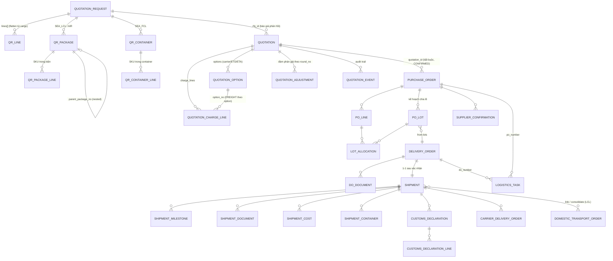
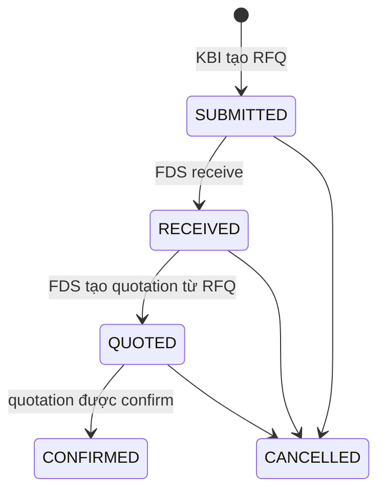
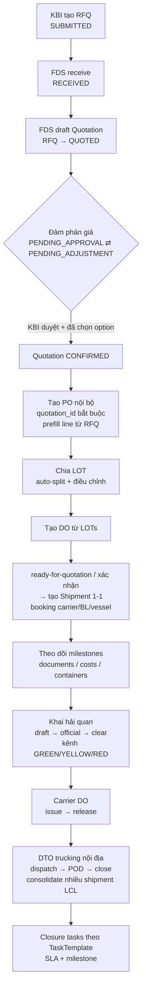

# KBFE GD1 — System Design (ERD + Schema + Workflow)

> Tài liệu mô phỏng lại thiết kế hệ thống dưới góc nhìn System Designer, tổng hợp từ
> `docs/API_CONTRACT.md`, `src/shared/model/logistics.ts` và các API module trong
> `src/shared/api/`. Đây là mô hình dữ liệu mà backend thật phải hiện thực hoá;
> frontend hiện tiêu thụ nó qua mock backend cùng contract.

## 1. Tổng quan luồng nghiệp vụ (GD1: Procurement & Import Tracking)

```text
RFQ (KBI gửi yêu cầu báo giá)
  └─> Quotation (FDS báo giá, đàm phán giá, KBI duyệt)
        └─> Purchase Order (chỉ tạo được từ Quotation CONFIRMED)
              └─> PO Lines ──> LOTs (kế hoạch chia lô)
                    └─> Delivery Order (DO nội bộ, tạo từ LOTs)
                          └─> Shipment (1 DO = 1 Shipment sau xác nhận)
                                ├─> Customs Declaration (tờ khai hải quan)
                                ├─> Carrier DO (lệnh giao hàng của hãng tàu)
                                └─> DTO (vận tải nội địa, có thể gom nhiều shipment LCL)
```

Vocabulary chuẩn: **PO → DO → Shipment → DTO**. DO và DTO là hai thực thể khác nhau —
DTO (Domestic Transport Order) phụ trách trucking nội địa + POD sau thông quan.

## 2. ERD — Master Data

```mermaid
erDiagram
    SUPPLIER {
        string id PK
        string supplier_code UK
        string supplier_name
        string supplier_type "MANUFACTURER|TRADER|..."
        boolean is_active
    }
    FORWARDER {
        string id PK
        string forwarder_code UK
        string forwarder_name
        string forwarder_type "INTL|TRUCKING|MULTI"
        boolean is_active
    }
    CARRIER {
        string id PK
        string carrier_code UK
        string carrier_name
        string carrier_type "SHIPPING_LINE|AIRLINE"
        boolean is_active
    }
    ITEM {
        string id PK
        string item_code UK
        string item_name
        string item_category
        string item_type
        string uom_code FK
        boolean is_active
    }
    UOM {
        string id PK
        string uom_code UK "26 freight billing codes"
        string uom_name_en
        boolean is_active
    }
    CURRENCY {
        string id PK
        string currency_code UK
        string currency_name
        boolean is_active
    }
    CURRENCY_RATE {
        string code FK "VND base, vnd_rate = 1"
        decimal vnd_rate
    }
    INCOTERM {
        string id PK
        string incoterm_code UK "EXW FOB CIF DDP FCA CFR"
        string incoterm_name
        json charge_group_scope "nhom chi phi ben mua chiu"
        boolean insurance_required
        boolean is_active
    }
    TRANSPORT_MODE {
        string id PK
        string mode_code UK "SEA|AIR|ROAD|RAIL"
        string mode_name
        boolean is_active
    }
    CHARGE_CODE {
        string id PK
        string charge_code UK
        string charge_name_en
        string group "7 macro groups"
        string category "9 row categories"
        string rev_cost "REVENUE|COST|BOTH"
        boolean sea_fcl
        boolean sea_lcl
        boolean air
        boolean road
        boolean rail
        boolean is_active
    }
    CONTAINER_TYPE {
        string id PK
        string cont_code UK
        string name_en
        boolean is_active
    }
    TASK_TEMPLATE {
        string id PK
        string task_code UK
        string task_name
        string group_code
        string milestone_code FK
        int sla_hours
        string department
        string assignee_role
        json required_documents
        int sort_order
        boolean is_active
    }

    CURRENCY ||--o| CURRENCY_RATE : "tỷ giá tham chiếu"
    UOM ||--o{ ITEM : "đơn vị mặc định"
```



Ghi chú:
- `CHARGE_CODE.group` (7 nhóm vĩ mô: `ORIGIN_EXPORT`, `MAIN_FREIGHT`, `FREIGHT_SURCHARGE`, `DOCUMENTATION_FILING`, `DESTINATION_IMPORT`, `ANCILLARY_ACCESSORIAL`, `SERVICE_OTHER`) và `category` (9 loại dòng) là **hai taxonomy độc lập**.
- FCL/LCL không nằm trong Transport Mode — được mô hình bằng `shipment.load_type` + cờ áp dụng trên charge code.
- Tỷ giá là dữ liệu giao dịch, tách khỏi Currency master.

## 3. ERD — Transactional (luồng chính)



Khóa ngoại sang master data:

| Bảng giao dịch | FK → Master |
|---|---|
| QUOTATION_REQUEST | supplier_id, incoterm_code, mode, currency_code, item_id (lines) |
| QUOTATION | currency_code (tiền thanh toán), incoterm_code; charge_line → charge_code, currency_code (tiền gốc từng dòng) |
| PURCHASE_ORDER | supplier_id, currency_code, incoterm_code; line → item_id, uom |
| SHIPMENT | carrier_id (SHIPPING_LINE/AIRLINE), forwarder_id, mode, load_type; container → container_type |
| CARRIER_DELIVERY_ORDER | forwarder_id |
| DOMESTIC_TRANSPORT_ORDER | truck_vendor_id → Forwarder (TRUCKING/MULTI) |
| LOGISTICS_TASK | template → TASK_TEMPLATE (milestone_code, department, assignee_role) |

## 4. Schema chi tiết các bảng chính

### 4.1 `quotation_requests` (RFQ)

RFQ là yêu cầu inbound do KBI nhập, **trước khi** FDS soạn quotation — thực thể top-level, không sinh từ PO nội bộ.

| Cột | Kiểu | Ghi chú |
|---|---|---|
| id | PK | |
| status | enum | `SUBMITTED → RECEIVED → QUOTED → CONFIRMED` (+`CANCELLED` trước khi confirm) |
| customer_po_ref | text | Số PO SAP của KBI (free-text) |
| customer_contract_ref | text? | |
| supplier_id | FK | |
| incoterm_code, mode, currency_code | FK | mode: `AIR` / `SEA_LCL` / `SEA_FCL` |
| origin_port, destination_port | text | POL / POD |
| cargo_ready_date | date | |
| gross_weight_kg, volume_cbm | decimal? | header derive từ cargo (client-side) |
| dim_weight_kg, chargeable_weight_kg | decimal? | chỉ AIR: `dim = cbm × 1.000.000 / 6000`, `chargeable = max(gross, dim)` |
| chargeable_revenue_ton | decimal? | chỉ SEA_LCL: `max(cbm, gross/1000)` (quy tắc W/M) |

Bảng con: `lines[]` (line_no, item_id, qty, unit, unit_price — **flatten** từ cargo, không nhập tay), `packages[]` (kích thước, qty, gross/kiện, `cbm = qty×L×W×H/10⁶`, `parent_package_no` cho đóng gói lồng nhau, `lines[]` SKU bên trong), `containers[]` (container_type, qty, `lines[]` có gross_weight_kg từng dòng).

### 4.2 `quotations` + bảng con

Quotation là **báo giá cước độc lập trước PO** (FDS → khách hàng), không cần DO.

| Cột | Kiểu | Ghi chú |
|---|---|---|
| id, rfq_id? | PK, FK | copy customer/supplier/route/mode/incoterm từ RFQ |
| status | enum | xem state machine §5.2 |
| currency_code | FK | **tiền thanh toán của khách** — mọi tổng hiển thị quy đổi về đây qua `currency_rates` |
| customer_ref, incoterm_code, mode | | |
| selected_option_id | FK? | confirm bắt buộc phải có (nếu không → `BUSINESS_RULE_VIOLATION`) |
| reject_reason | text? | |

- `quotation_charge_lines`: charge_code, qty, unit_price, `currency_code` (**tiền gốc/local từng dòng**, giữ cho audit), `charge_group` (`FREIGHT|ORIGIN|DESTINATION`), `option_no` (`null` = dùng chung mọi option; `N` = FREIGHT riêng của option N).
- `quotation_options`: carrier, vessel/flight, ETD/ETA, transit days, risk warning, headline amount, cờ recommended. Chọn 1 option qua `select-option`.
- `adjustments[]`: lịch sử đàm phán giá theo `round_no` (KBI đề xuất từ `PENDING_APPROVAL`, FDS phản hồi từ `PENDING_ADJUSTMENT`).

### 4.3 `purchase_orders` (FDS internal)

| Cột | Ghi chú |
|---|---|
| quotation_id | **bắt buộc**, phải trỏ đến quotation `CONFIRMED` — trace ngược về RFQ |
| status / lifecycle_status | `lifecycle_status` do backend tính = trạng thái shipment **chậm nhất** trong các shipment liên kết, map về taxonomy stage của PO |
| origin_port, destination_port | POL/POD mặc định — auto-split PO line → LOT sẽ copy sang LOT mặc định |

Bảng con: `po_lines` (item, qty, đơn giá, status `OPEN → PARTIALLY_SHIPPED → SHIPPED → RECEIVED → CLOSED`), `po_lots` (lô kế hoạch, override POL/POD từng lô, reorder/move/split line), `lot_allocations` (map line↔lot), `supplier_confirmations`.

### 4.4 `delivery_orders` (DO nội bộ)

- Tạo từ LOTs (`POST /delivery-orders/from-lots`, nhận `lot_ids`, POL/POD map vào `origin_address`/`destination_address`).
- `order_info.status` trên màn hình là **derived** từ shipment chậm nhất sau khi handoff (trừ `CANCELLED`/`CLOSED` là terminal) — song song với quy tắc `lifecycle_status` của PO.
- Bảng con: documents (upload chứng từ), lots, lines; `task_summary`, `missing_documents`, `warehouse` là screen-DTO.

### 4.5 `shipments` + vệ tinh

| Cột | Ghi chú |
|---|---|
| delivery_order_id | 1-1; DO bị chặn tạo shipment nếu `CANCELLED`/`CLOSED`/`ASSIGNED_TO_SHIPMENT` |
| mode + load_type | load_type: `FCL/LCL` (sea), `FTL/LTL` (road), nullable |
| carrier_id / carrier | FK Carrier + tên denormalized để hiển thị/lọc |
| forwarder_id | FK Forwarder (không phải Supplier) |

Vệ tinh: `milestones` (done theo `code`), `documents`, `costs`, `containers`, `customs_declarations` (+lines, luồng `open-draft → open-official → clear`, kênh `GREEN/YELLOW/RED`), `carrier_delivery_orders` (`issue → release`, có forwarder).

### 4.6 `domestic_transport_orders` (DTO)

- Tạo từ 1 shipment, hoặc `consolidate` nhiều shipment LCL (atomic), quan hệ N-M qua link/unlink.
- `truck_vendor_id` → Forwarder loại `TRUCKING`/`MULTI`.
- Chuyển trạng thái qua action endpoints: `dispatch`, `pod-received`, `close`, …

### 4.7 `tasks`

- `LogisticsTask`: task_id, task_name, do_number/po_number/production_contract_number (context), role, assignee, priority, status (`TODO|PENDING|IN_PROGRESS|WAITING|BLOCKED|COMPLETED|CANCELLED`), progress, due_date, blocked_reason, `template` → TaskTemplate (milestone, department).
- GD1 PO checkpoints (`Gd1PoStageTask`) sinh từ `Gd1PoTaskTemplate` theo stage của PO.

## 5. State machines

### 5.1 RFQ



### 5.2 Quotation (5 trạng thái + vòng đàm phán)

```mermaid
stateDiagram-v2
    [*] --> REQUEST_FOR_QUOTATION : request
    REQUEST_FOR_QUOTATION --> DRAFT : receive (FDS soạn)
    DRAFT --> PENDING_APPROVAL : submit-to-kbi
    PENDING_APPROVAL --> PENDING_ADJUSTMENT : KBI negotiate (đề xuất giá)
    PENDING_ADJUSTMENT --> PENDING_APPROVAL : FDS accept/counter
    PENDING_APPROVAL --> CONFIRMED : confirm-by-kbi / mark-final (cần selected_option_id)
    PENDING_APPROVAL --> REJECTED : reject (reason)
    note right of CONFIRMED : Mở khóa tạo PO; RFQ liên kết chuyển CONFIRMED
```



### 5.3 Workflow end-to-end



## 6. Quy ước cross-cutting

1. **Envelope kép**: routes `/v1/*` dùng envelope chuẩn `{ data, meta, errors }`; master data compat mounts `/api/*` dùng `{ data, total, pagination }`. Xử lý tách biệt.
2. **Screen-DTO principle**: các màn hình list nặng đọc DTO tổng hợp do backend dựng (`/delivery-orders/screen`, `/purchase-orders/:id/lot-planning`), không tự join phía client.
3. **Trạng thái dẫn xuất (laggard rule)**: stage của PO và status hiển thị của DO đều lấy theo shipment **kém tiến độ nhất** — backend là source of truth, client chỉ fallback.
4. **Tiền tệ 2 tầng**: `charge_line.currency_code` là tiền gốc từng dòng (audit); `quotation.currency_code` là tiền thanh toán — mọi tổng khách thấy quy đổi qua `/v1/currency-rates` (VND base), không có subtotal theo từng loại tiền.
5. **Công thức cargo theo mode**: AIR dùng divisor 6000 (IATA); SEA_LCL dùng W/M revenue-ton; SEA_FCL theo container, các trường CBM/weight header đều `null`.
6. **Frontend FSD**: `app → features → entities → shared`, một chiều; server state qua TanStack Query (`queryKeys.ts` duy nhất), UI state qua Zustand store per-feature.
